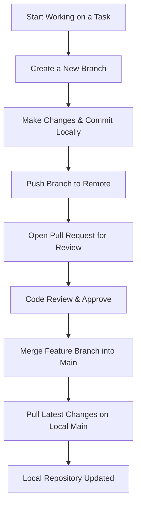

# Beginner's Guide to Git with VSCode (GitHub/ADO Repos)

This guide is designed for beginners to help you work efficiently with Git repositories (GitHub or Azure DevOps) using VSCode. It explains the basic Git operations with simple explanations and examples.

---

## Getting Started

### 1. **Installing Git and VSCode**

- Download and install Git from [git-scm.com](https://git-scm.com/downloads).
- Install VSCode from [code.visualstudio.com](https://code.visualstudio.com/).
- Open VSCode and ensure Git is installed by running:

  ```bash
  git --version
  ```

---

## Basic Git Operations in VSCode

| **Operation** | **What It Does** | **Why It's Important** | **How to Do It (VSCode & CLI)** |
|--------------|------------------|-------------------------|--------------------------------|
| **Clone Repo** | Copies a remote repository to your computer | Get a working copy locally | `git clone <repo-url>` or *VSCode: Git: Clone* |
| **Clone Specific Branch** | Clones only a specific branch | Focus on particular feature/work | `git clone -b <branch-name> <repo-url>` |
| **List Branches** | Shows all branches in repository | See available work streams | `git branch` or *VSCode: Click branch name in status bar* |
| **New Branch** | Creates a separate branch for a feature or fix | Keeps work organized and isolated | `git checkout -b my-feature` |
| **Switch Branch** | Changes to another branch | Move between different features/work | `git switch <branch-name>` or *VSCode: Click branch in status bar* |
| **Commit** | Saves changes to your local repo | Allows rollback and tracking | `git add . && git commit -m "Added feature"` |
| **Push** | Uploads local commits to GitHub/ADO | Shares work with others | `git push origin my-feature` |
| **Pull** | Gets latest updates from remote repo | Keeps your local copy updated | `git pull origin main` |
| **Merge Branch** | Combines branch changes into main | Integrates finished work | `git checkout main && git merge my-feature` |
| **Rollback** | Undo changes if needed | Reverts mistakes | `git revert <commit-hash>` or `git reset --hard <commit-hash>` |

---

## Step-by-Step Guide

### 1️ Cloning a Repository

| Command | Description | Example |
|---------|-------------|---------|
| `git clone <url>` | Clone entire repository | `git clone https://github.com/username/repository.git` |
| `git clone -b <branch> <url>` | Clone specific branch only | `git clone -b develop https://github.com/username/repository.git` |

**In VSCode:**

| Action | Steps |
|--------|-------|
| Clone Repository | 1. `Ctrl+Shift+P` / `Cmd+Shift+P`<br>2. Type "Git: Clone"<br>3. Enter repository URL |
| Switch to Branch | 1. Click branch name in status bar<br>2. Select branch from dropdown |

### 2️ Working with Branches

**List All Branches:**

```bash
git branch          # List local branches
git branch -r       # List remote branches
git branch -a       # List all branches (local and remote)
```

**Creating a New Branch:**

```bash
git checkout -b feature/add-user-authentication
```

**Switching Branches:**

```bash
git switch main                  # Modern way (Git 2.23+)
git checkout another-branch      # Traditional way
```

OR in VSCode:

- Go to Source Control → Click the Branch icon → Create Branch.
- To switch: Click on the branch name in the status bar → Select branch.

### 3️ Listing Branches

```bash
git branch
```

OR in VSCode:

- Click the branch name in the status bar to view all branches.

### 4️ Creating a New Branch

```bash
git checkout -b feature/add-user-authentication
```

OR in VSCode:

- Go to Source Control → Click the Branch icon → Create Branch.

### 5️ Switching Branches

```bash
git switch <branch-name>
```

OR in VSCode:

- Click the branch name in the status bar and select the desired branch.

### 6️ Making Commits

```bash
git add .
git commit -m "feat: add authentication"
```

OR in VSCode:

- Open Source Control → Stage changes → Enter commit message → Click commit.

### 7️ Pushing Changes

```bash
git push origin feature/add-user-authentication
```

To see commits

```bash
git log
```

OR in VSCode:

- Click the “Push” button in the Source Control view.

### 8️ Pulling Changes

```bash
git pull origin main
```

OR in VSCode:

- Use the “Pull” option from Source Control.

### 9️ Merging Branches

```bash
git checkout main
git merge feature/add-user-authentication
```

OR in VSCode:

- Switch to main → Use the merge tool.

### 10 Rolling Back Changes

- **Revert a Commit (Safe Way):**

  ```bash
  git revert <commit-hash>
  ```

- **Reset a Branch (Local Only, USE WITH CAUTION):**

  ```bash
  git reset --hard <commit-hash>
  ```

---

## Git Workflow Diagram (Mermaid)


